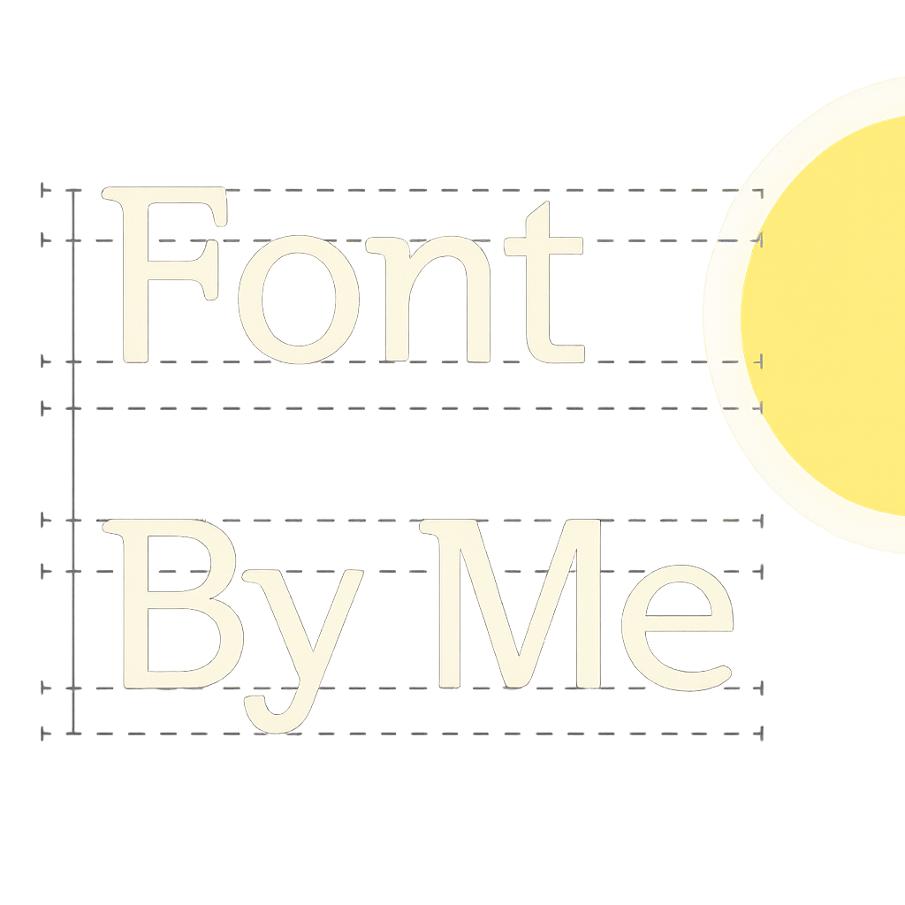

# FontByMe - 내글씨폰트

<p align="right">
  
</p>

HNU 2025 AI-programming course fall

20222328 윤여명 / 20202474 황경준 / 20232708 김수인

## 프로젝트 개요

사용자의 손글씨 PDF를 입력받아 2,350자 한글 폰트(TTF)를 자동 생성하는 딥러닝 기반 시스템입니다.

- **Content-Style 분리 학습**: 글자 구조(Content)와 필체 스타일(Style)을 분리하여 학습
- **약 200자 샘플로 전체 폰트 생성**: 제한된 입력에서 2,350자를 생성
- **End-to-end 자동화**: PDF 업로드 → 글자 추출 → 모델 추론 → SVG 벡터화 → TTF 생성

## 시스템 구조

```
[1단계: Content Encoder 사전 학습]
- 표준 폰트(NotoSansKR) 2,350자 → 64D Content Latent (고정)

[2단계: Style Encoder + Joint Decoder 통합 학습]
- 입력 이미지 → 32D Style Vector
- Content + Style → Decoder → 생성 이미지

[후처리]
- PNG → SVG (potrace) → TTF (fontmake)
```

## 학습 버전

| 버전 | 학습 데이터 | 특징 | 현재 상태 |
|------|-----------|------|----------|
| v1 | 촬영 손글씨 (원본) | 도메인 불일치 문제 | `runs/joint/` |
| **v2** | 폰트 렌더링 (112개) | **UI 연결됨** | `runs/font_v2/` |
| v3 | 이진화 손글씨 | 실험 중 | `runs/handwriting_v3/` |

## 필수 의존성

### Python 패키지
| 패키지 | 용도 |
|--------|------|
| `tensorflow` | 딥러닝 모델 추론 |
| `Pillow` | 이미지 처리 |
| `numpy` | 수치 연산 |
| `pdf2image` | PDF → 이미지 변환 |
| `fonttools` | TTF 폰트 생성 |
| `tkinterdnd2` | 드래그 앤 드롭 UI |

### 시스템 도구
| 도구 | 용도 | 필수 여부 |
|------|------|----------|
| **Poppler** | PDF를 이미지로 변환 | ✅ 필수 |
| **potrace** | PNG → SVG 벡터 변환 | ✅ 필수 |
| **FontForge** | SVG → TTF 폰트 빌드 | ✅ 필수 |

---

## 설치 방법

### macOS (Homebrew)
```bash
# Python 패키지
pip install -r requirements-ui.txt

# 시스템 도구
brew install poppler potrace fontforge
```

### Windows
```bash
# Python 패키지
pip install -r requirements-ui.txt
```

**시스템 도구 개별 설치:**

1. **Poppler**: [다운로드](https://github.com/oschwartz10612/poppler-windows/releases) → `bin` 폴더를 PATH에 추가
2. **potrace**: [다운로드](https://potrace.sourceforge.net/#downloading) → `potrace.exe`를 PATH에 추가
3. **FontForge**: [다운로드](https://fontforge.org/en-US/downloads/) → 설치 경로를 PATH에 추가

---

## 실행

```bash
python command/run
```

최초 실행 시 필요한 의존성을 자동으로 검사합니다.

---

## 프로젝트 구조

```
FontByMe/
├── ui/font_ui.py           # GUI 애플리케이션
├── src/
│   ├── inference/          # 추론 파이프라인 (v1, v2, v3)
│   ├── train_v2/           # 학습 스크립트
│   └── models/             # 신경망 모델 정의
├── runs/                   # 학습된 모델 (.h5)
│   ├── autoenc/            # Content Encoder + Latents
│   ├── joint/              # v1 모델
│   ├── font_v2/            # v2 모델 (현재 사용)
│   └── handwriting_v3/     # v3 모델
├── data/                   # 학습 데이터 (gitignore)
└── fonts/                  # 폰트 파일
```

## 모델 규모

| 모듈 | 파라미터 수 | 크기 |
|------|-----------|------|
| Content Encoder | ~1.2M | ~5 MB |
| Style Encoder | ~1.2M | ~5 MB |
| Joint Decoder | ~8.5M | ~35 MB |

## 데이터 및 리소스 출처

| 리소스 | 출처 | 용도 |
|--------|------|------|
| 손글씨 데이터 | [AI Hub 한글 손글씨](https://aihub.or.kr/aihubdata/data/view.do?dataSetSn=91) | 122명 작가, 276K 이미지 |
| 폰트 데이터 | [네이버 나눔글꼴](https://hangeul.naver.com/fonts/search?f=nanum), [Google Fonts](https://fonts.google.com) | 112개 폰트 렌더링 |
| 기준 폰트 | [Noto Sans KR](https://fonts.google.com/noto/specimen/Noto+Sans+KR) | Content Latent 생성 |
| 프레임워크 | [TensorFlow/Keras](https://tensorflow.org) | 모델 학습/추론 |
